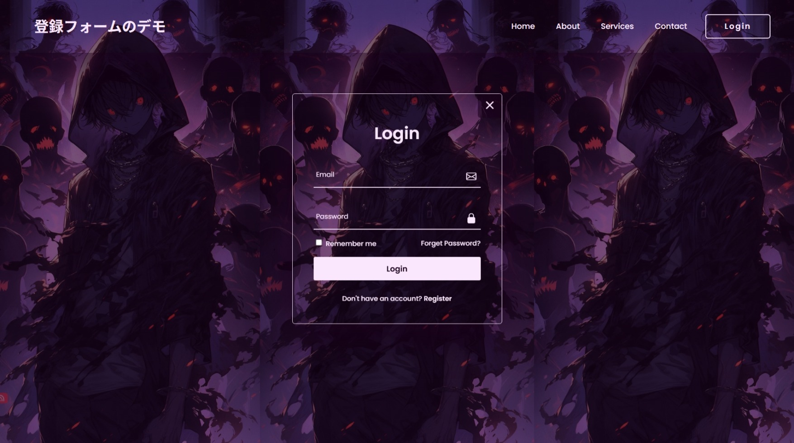
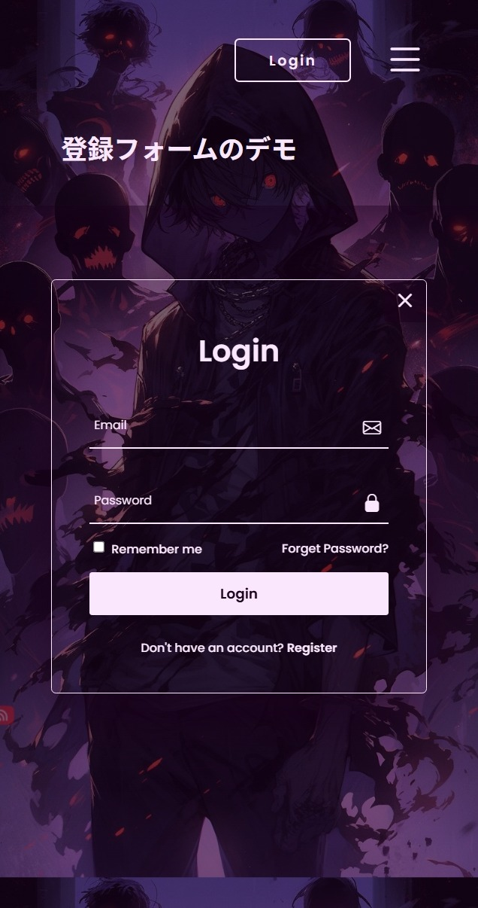

# 🖥️📱 Responsive Form & Navbar Demo

A modern **Responsive Navbar + Login/Register Form** project built with **HTML, CSS, and JavaScript**, featuring animated transitions, smooth overlay effects, and adaptive layouts for all screen sizes.

🔗 **Live Demo: [https://nsnet21.github.io/03-responsive-form-and-navbar/](https://nsnet21.github.io/03-responsive-form-and-navbar/)**

---

## 🖼️ Preview

### 💻 Full Screen (Desktop)



### 📱 Mobile Version



---

## 🚀 Features

### 🧭 Responsive Navbar

- Fully adaptive layout with media queries (`1100px`, `565px` breakpoints).
- **Hamburger menu** for small screens.
- Click outside to auto-close the mobile menu.
- Animated hover underline with accent color.

### 🔐 Animated Login / Register Form

- Modal-style popup with **blurred glass effect**.
- Smooth transition between **Login** ↔ **Register** via `.active` toggle.
- Supports “Remember me” and “Agree to terms” interactions.
- Close icon dynamically highlights border color on hover.

### 💡 Additional UI Details

- Accent glow animation when hovering close button.
- Clean and minimal **Poppins font** typography.
- Adaptive mobile layout for Login button & Hamburger alignment.

---

## 🧩 Tech Stack

| Category    | Technology                                                          |
| ----------- | ------------------------------------------------------------------- |
| Markup      | HTML5                                                               |
| Styling     | CSS3 (Variables, Flexbox, Media Queries)                            |
| Interaction | Vanilla JavaScript                                                  |
| Icons       | [Bootstrap Icons](https://icons.getbootstrap.com/)                  |
| Font        | [Google Fonts – Poppins](https://fonts.google.com/specimen/Poppins) |

---

## 📂 Project Structure

```plaintext
03Responsive-Form-and-Navbar/
│
├── assets-preview/
│ ├── full-screen-preview.jpeg
│ └── mobile-preview.jpeg
│
├── images/
│ └── 紫の空気感の壁紙 3.jpg
│
├── index.html
├── style.css
├── script.js
├── README.md
└── .gitignore

```

## ⚙️ How It Works

1.  **Navbar Toggle Logic**

    ```js
    const hamIcon = document.getElementById("hamMenu");
    const rightNavBar = document.getElementById("rightNavbar");

    hamIcon.addEventListener("click", () => {
      rightNavBar.classList.toggle("show-state");
    });
    ```

2.  **Outside Click to Close**

    ```js
    document.addEventListener("click", (e) => {
      const isClickInNavbar = rightNavBar.contains(e.target);
      const isClickInHamIcon = hamIcon.contains(e.target);
      if (!isClickInNavbar && !isClickInHamIcon) {
        rightNavBar.classList.remove("show-state");
      }
    });
    ```

3.  **Form Show / Hide Logic**

    ```js
    const showForm = document.getElementById("showForm");
    const formContainer = document.getElementById("formContainer");

    showForm.addEventListener("click", () => {
      formContainer.classList.toggle("form-show");
    });
    ```

4.  **Login ↔ Register Switch**

    ```js
    const loginLink = document.getElementById("loginLink");
    const registerLink = document.getElementById("registerLink");

    registerLink.addEventListener("click", () => {
      formContainer.classList.add("active");
    });

    loginLink.addEventListener("click", () => {
      formContainer.classList.remove("active");
    });
    ```

5.  **Close Button Hover Effect**

    ```js
    const iconClose = document.getElementsByClassName("icon-close")[0];

    iconClose.addEventListener("mouseenter", () => {
      formContainer.style.borderColor = "var(--accent)";
      formContainer.style.boxShadow = "0 0 50px var(--accent)";
    });

    iconClose.addEventListener("mouseleave", () => {
      formContainer.style.borderColor = "";
      formContainer.style.boxShadow = "";
    });
    ```

## 🧠 Learning Focus

- Practiced DOM manipulation using `add`, `remove`, and `toggle` for UI states.
- Improved understanding of responsive layout design with `@media` queries.
- Enhanced form interaction and animation handling in JavaScript.
- Strengthened visual feedback skills with hover, transition, and glow effects.

